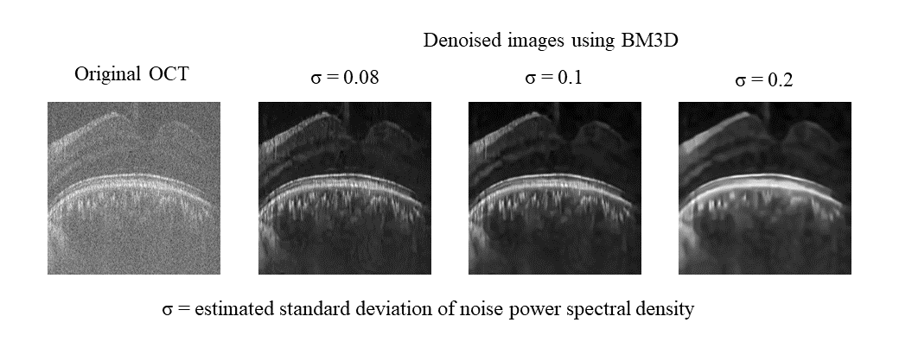
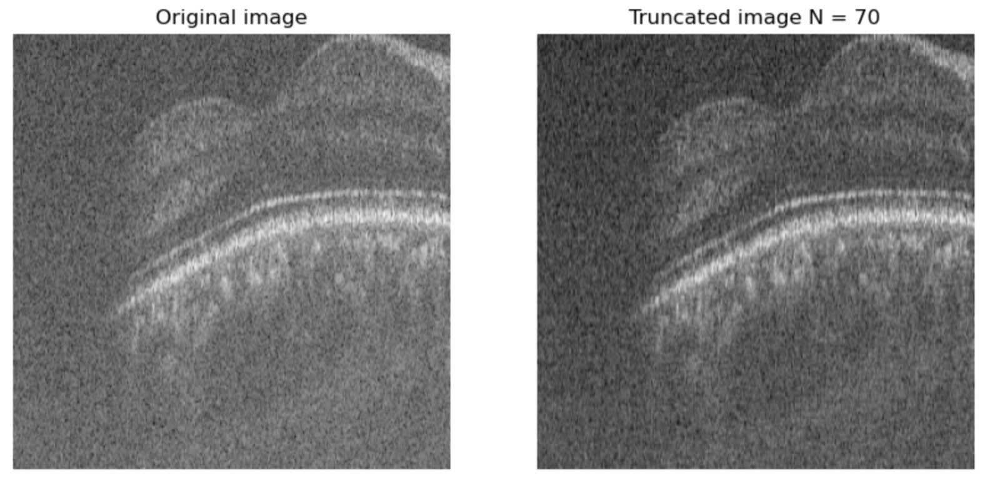
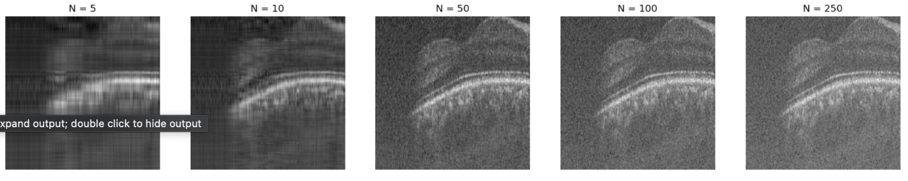

# denoising-techniques
A collection of denoising technique experimenting to denoise OCT B-Scans. Includes conventional and modern methods.

## Conventional Methods

### 1. Wavelet Transform & Wavelet thresholding
[Devnith] Currently working on wavelet transform based denoising methods using MATLAB and Python.

### 2. BM3D

Old approach: [Nadun & Ravindu] Used the implementation by Chihao Zhang at "https://github.com/ChihaoZhang/BM3D".

Latest approach: [Nadun] Used the bm3d python library based on original bm3d paper.

#### BM3D Comparison

### 3. SVD Thresholding
[Devnith] Tested SVD truncation and got positive results. Working on finding the optimal threhold or using soft thresholding. Literature is mentioned in the pdfs.

#### SVD-HT Comparison

Following comparison shows the noise level improvement

Following series of SVD reconstruction shows suppression of noise with truncated sigma values. 

