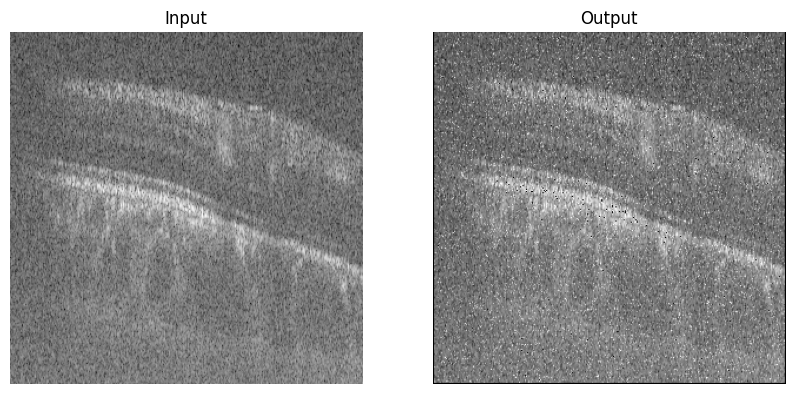

# denoising-techniques

A collection of denoising technique experimenting to denoise OCT B-Scans. Includes conventional and modern methods.

## Conventional Methods

### 1. Wavelet Transform & Wavelet thresholding

[Devnith] Currently working on wavelet transform based denoising methods using MATLAB and Python.

### 2. Anisotropic Diffusion

[Sasika]

- Code Inspiration :
  - https://github.com/awangenh/fastaniso
  - https://github.com/pastapleton/Perona-Malik/blob/master/Perona-Malik%20-%20Cian%2C%20Patrick%2C%20Ivan.py
  - https://www.kaggle.com/code/kmader/anisotropic-diffusion-example/data

- Notebook : [Google Colab](https://colab.research.google.com/drive/12pUjIZaGN8XPxSvOEXULvBCCSW63sDTY?usp=sharing)
- output result zip : [Google Drive folder link](https://drive.google.com/drive/folders/1E9wprPi2y7oWfUMMCu1VwjzhYNzrzv6V?usp=sharing)

#### Anisotropic Diffusion Comparison

